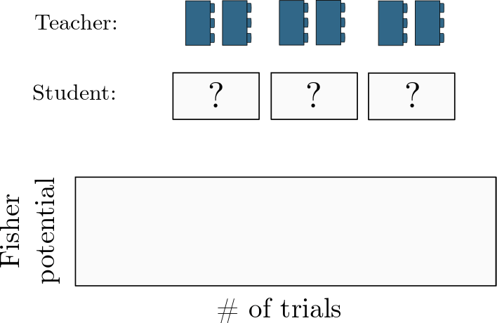

# [BlockSwap: Fisher-guided Block Substitution for Network Compression on a Budget](https://arxiv.org/abs/1906.04113)

This repository contains the code used to produce BlockSwap ([paper](https://arxiv.org/abs/1906.04113)) .

For a network composed of *N* stacked blocks, BlockSwap (uniformly) randomly suggests lists of *N* possible convolution alternatives based on a parameter budget. It ranks the samples using *Fisher potential* as a proxy for trained accuracy and then returns the best one:



## Setup

Install the requirements via [anaconda](https://docs.conda.io/projects/conda/en/latest/user-guide/install/index.html#):

```
conda env create -f environment.yml
```

## Repository layout
- `checkpoints/` is used to save trained models
- `genotypes/` is used to store `.csv` files that contain network configurations chosen by BlockSwap. We have also included the exact models from the paper for reference.
- `models/` contains PyTorch definitions for all of the models and blocktypes that we used
    - `models/blocks.py` is where all of the block substitutions live
- `utils.py` contains useful operations that are used throughout the repository. It also includes random configuration sampling code.
    - `one_shot_fisher` is the function used to get the Fisher potential of a given network
- `model_generator.py` ranks random configurations at a given parameter goal
- `train.py` can train your selected network

## Running the experiments from the paper

The general outline for using this code is as follows:
1. Train your original network (the network you would like to compress, also called the *teacher*)
2. Generate and rank possible student networks for a given parameter budget
3. Train the highest ranking student network

These steps are illustrate below:

**1. Train your original network**  

```bash
python train.py teacher -t wrn_40_2 --wrn_depth 40 --wrn_width 2 --data_loc='<path-to-data>' --GPU 0
```

**2. Generate and rank possible student networks for a given parameter budget**  
Then you can generate student networks for a parameter goal of your choice:
```bash
python model_generator.py --data_loc='<path-to-data>' --param_goal $p
```
This will save a `.csv` file containing the generated architecture.

**3. Train the highest ranking student network**  
Train the network using the following command:
```bash
python train.py student -t wrn_40_2 -s wrn_40_2_<genotype-num> --wrn_depth 40 --wrn_width 2 --data_loc='<path-to-data>'  --GPU 0 --from_genotype './genotypes/<genotype-num>.csv'
```

## Acknowledgements

The following repos provided basis and inspiration for this work:

```
https://github.com/szagoruyko/attention-transfer
https://github.com/kuangliu/pytorch-cifar
https://github.com/xternalz/WideResNet-pytorch
https://github.com/ShichenLiu/CondenseNet
```

## Citing us
If you find this work helpful, please consider citing us:

```bibtex
@inproceedings{
Turner2020BlockSwap:,
title={BlockSwap: Fisher-guided Block Substitution for Network Compression on a Budget},
author={Jack Turner and Elliot J. Crowley and Michael O'Boyle and Amos Storkey and Gavin Gray},
booktitle={International Conference on Learning Representations},
year={2020},
url={https://openreview.net/forum?id=SklkDkSFPB}
}
```
